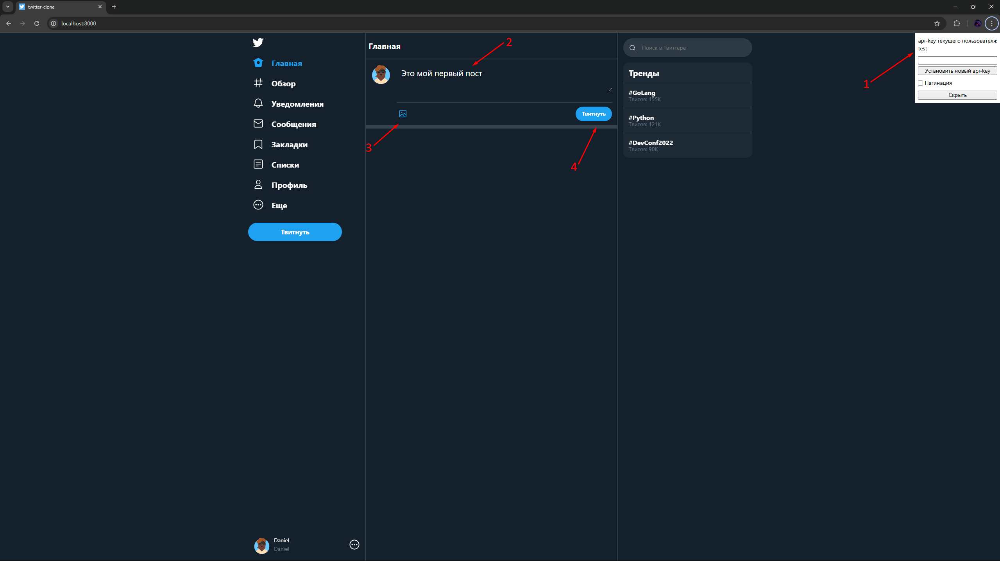

Вот пример базового шаблона README для твоего приложения:

---

# Twitter-like API

Это проект, реализующий простой API, имитирующий функциональность социальной сети, аналогичной Twitter. Пользователи могут создавать аккаунты, публиковать твиты, загружать медиафайлы, ставить лайки и следить за другими пользователями.

## Описание

API предоставляет следующие возможности:

- Создание нового пользователя.
- Публикация твитов с текстом и медиафайлами.
- Лайкать и удалять лайки с твитов.
- Подписываться на других пользователей и отписываться от них.
- Получение списка твитов от пользователей, на которых подписан текущий пользователь.
- Загрузка медиафайлов (например, изображений) и ассоциирование их с твитами.

## Структура проекта

- **`server/main.py`** — основной файл с FastAPI, где реализован весь функционал.
- **`models.py`** — описание моделей для работы с базой данных (SQLAlchemy).
- **`database.py`** — настройка подключения к базе данных и создание сессий.
- **`media_files/`** — каталог для хранения загруженных медиафайлов.

## Запуск

### Запускается приложение одной командой:

   ```bash
    docker-compose up --build
   ```

   По умолчанию сервер будет доступен по адресу `http://127.0.0.1:8000`.

## Функционал сайта

### Главная страница


#### 1. Указывается api ключ по которому пользователь получает доступ к ресурсу
#### 2. Поле для ввода текста поста, если пользовать хочет сделать новый пост
#### 3. Возможно добавления медиафайлов к посту

**POST** `/api/medias`

#### 4. Публикация самого поста

**POST** `/api/tweets`

На странице пользователя будет создан новый твит. Также в ленте будут отображаться посты от пользователей на которых есть подписка

### Пост
После публикации пост отображается в ленте у пользователей есть возможность лайкнуть пост, перейти на страницу автора поста, удалить пост если вы его владелец.

А также просмотреть список пользователь лайкнувших пост

**POST** `/api/tweets/{post_id}/likes`

**DELETE** `/api/tweets/{post_id}/likes`

**DELETE** `/api/tweets/{post_id}`


